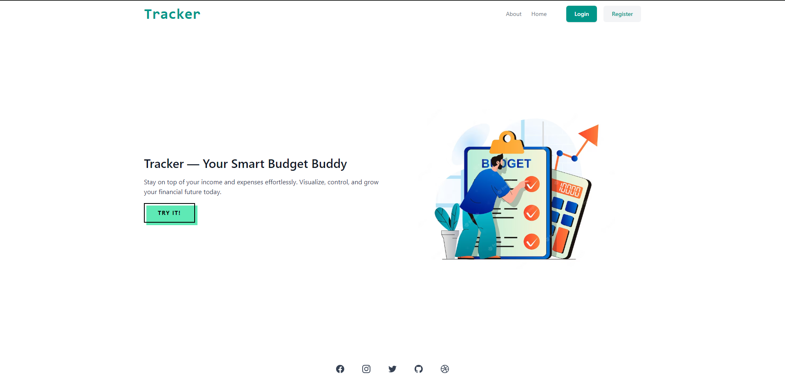

# Tracker

A smart and simple React + Spring Boot full-stack application to track income, expenses, and budgeting — all in one place.

## Features

- Track income and expenses
- Login/Signup authentication
- Visual charts (planned)

## Tech Stack

**Frontend:** React, Tailwind CSS, React Router  
**Backend:**  Spring Boot, MySQL  
**Build Tools:** Parcel, Maven  

## Installation
### Node.js installation
        Note to run the project at local system you need "Node" installed in your system. Do following to install Node.js
        1.  Go to https://nodejs.org/en/download
            Download the LTS (Long-Term Support) version (recommended for most users).
        2.  Run the installer and follow the prompts.
        3.  After installation, verify with:
            node -v
            npm -v
        4. Update NPM globally 
            npm install -g npm
### Frontend
        1. Clone the project and open it in Code editor. Use the commnad to go into project root directory if needed
            cd budget-tracker-frontend
        2. Goto helper.js (src/services/helper.js) and change BASE_URL = "http://localhost:8080" to point to your backend server;    
        3. Run the following command to install all dependencies
            npm install
        4. Start the server using this command
            npm start
    

# 📦 API Reference
- GET /api/transactions – Fetch all transactions
- POST /api/transactions – Add a new transaction
- POST /api/auth/login – User login
- POST /api/auth/register – User registration

# Check Backend code at following github repositiory
- https://github.com/parmjotsingh/Tracker-Backend
